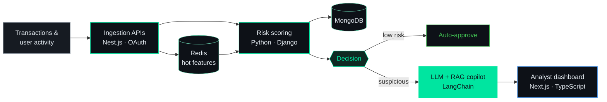

<div align="center">



[](https://portfolio-segun.vercel.app)

<a href="https://portfolio-segun.vercel.app"></a>
<a href="https://www.linkedin.com/in/segun-alabi-baa17225"></a>
<a href="mailto:segunalabi383@gmail.com"></a>
<a href="https://github.com/segunalabi383"></a>


</div>

<br/>

> **Senior engineer with 10+ years building real-time, high-throughput and AI-driven systems** across ride-sharing, enterprise SaaS, industrial IoT and e-commerce.
> As a **Founding Engineer**, I own the whole path from 0→1: product architecture, LLM integrations, streaming data pipelines and full-stack delivery on AWS/GCP.
> I care about one thing above all: **shipping work that moves a number.**

<br/>

## ⚡ Impact at a glance


## 🧭 Career path



---

## 🏗️ Flagship work

<details open>
<summary><b>🛡️ Uber — Real-Time Fraud Detection &amp; Risk Scoring Platform</b> &nbsp;·&nbsp; <code>2022 – now</code></summary>
<br/>

**The problem:** spot suspicious transactions in real time across high-volume workloads, without slowing riders, drivers or analysts down.


<sub><i>Simplified architecture.</i></sub>

| What I built | Result |
| :-- | :-- |
| API-first Python/Django + Node.js/Nest.js microservices with OAuth and role-based access | Secure, independently scalable services |
| Real-time scoring pipelines over transaction behavior, user activity and contextual signals | Automated risk decisions |
| LLM + RAG + LangChain analyst copilot for suspicious-transaction review | Faster, more accurate investigations |
| MongoDB and Redis access-pattern tuning | **30% lower latency** |
| React / Next.js risk-operations dashboards | **40% faster investigation decisions** |
| WebSocket / Socket.IO live earnings and incentive updates | Real-time UX |
| AWS, Docker, Kubernetes, Terraform, distributed tracing and observability | Higher production reliability |
| Mentored 3 engineers on AI integration, cloud-native design and API design | A stronger team |

`Python` `Django` `TypeScript` `Next.js` `Nest.js` `LLMs` `RAG` `LangChain` `MongoDB` `Redis` `AWS` `Docker` `Kubernetes` `Terraform`

</details>

<details>
<summary><b>🏭 Scribe — Predictive Maintenance &amp; Industrial Visualization Platform</b> &nbsp;·&nbsp; <code>2019 – 2022</code></summary>
<br/>

**The problem:** turn millions of industrial sensor readings into early warnings before equipment fails.

- 📉 **25% less equipment downtime** from predictive analytics and anomaly-detection models
- 🌊 Ingestion pipelines processing **50,000+ events per minute** for real-time analytics
- 📊 Real-time React, D3.js and Chart.js dashboards over **millions of data points**, with **40% faster rendering** through virtualization
- 🧩 A reusable TypeScript visualization library adopted by **6+ enterprise clients**
- 🔁 Worked with data scientists to put ML models into production with automated retraining
- 🚨 Event-driven alerting and monitoring for industrial systems

`React` `TypeScript` `D3.js` `Chart.js` `Python` `Node.js` `AWS` `Docker` `Kubernetes` `Predictive Analytics`

</details>

<details>
<summary><b>🎞️ Cognizant — Multimedia Data Analytics ETL Pipeline</b> &nbsp;·&nbsp; <code>2015 – 2019</code></summary>
<br/>

**The problem:** give analysts and field teams reliable visibility into high-volume multimedia ETL jobs.

- ⚙️ REST APIs and backend services for multimedia ingestion, processing, analytics and pipeline management
- 📱 React / React Native dashboards for ETL status, data quality and results, with **22% higher mobile engagement**
- ⚡ **40% faster web load times** from a modernized React architecture and faster APIs
- 📶 Offline-first mobile features with local sync, making field teams **30% more reliable**
- 🗄️ **50% faster reporting** from PostgreSQL query optimization and indexing
- 🚀 CI/CD with Docker on AWS that cut **deployments from hours to minutes**, plus Jest and Cypress test suites

`React` `React Native` `Node.js` `Nest.js` `PostgreSQL` `AWS` `Docker` `CI/CD` `Jest` `Cypress`

</details>

<sub>🎓 <b>B.S. Computer Science</b> — Princeton University (2011 – 2015)</sub>

---

## 🧠 How I build

| | Principle | In practice |
| :-: | :-- | :-- |
| 🎯 | **Impact first** | Every project starts with the metric it should move: latency, downtime or decision time. |
| ⚡ | **Real-time by default** | Streaming pipelines, WebSockets and caches so decisions happen while they still matter. |
| 🤖 | **AI with guardrails** | LLM and RAG features backed by automated evaluation pipelines, observability and retraining. |
| 🧱 | **Own the whole stack** | From Terraform and Kubernetes to the API contract and the pixel on the dashboard. |
| 🌱 | **Multiply the team** | Mentoring engineers on AI integration, streaming and scalable API design. |

---

## 🛠️ Toolbox

<table>
<tr><td><b>Languages &amp; Frontend</b></td><td></td></tr>
<tr><td><b>Backend &amp; Data</b></td><td></td></tr>
<tr><td><b>Cloud, DevOps &amp; QA</b></td><td></td></tr>
<tr><td><b>AI / ML</b></td><td>


</td></tr>
</table>

<details>
<summary><code>segun@dev:~$ cat stack.json</code></summary>

```json
{
  "name": "Segun Alabi",
  "title": "Senior Full Stack Engineer | Founding Engineer — AI/LLM & Cloud Platforms",
  "location": "East Orange, NJ",
  "experience": "10+ years",
  "languages": ["JavaScript (ES6+)", "TypeScript", "Python", "PHP", "SQL", "C#"],
  "frontend": ["React", "React Native", "Next.js", "Three.js", "D3.js", "Tailwind CSS", "Bootstrap", "Material-UI"],
  "backend": ["Nest.js", "Node.js", "Django", ".NET", "Laravel", "OAuth", "REST APIs", "Microservices"],
  "cloud": ["AWS", "EC2", "S3", "Lambda", "GCP", "Docker", "Kubernetes", "Terraform", "CI/CD Pipelines", "Distributed Tracing", "Observability"],
  "databases": ["PostgreSQL", "MySQL", "MongoDB", "Redis", "DynamoDB", "SQLite"],
  "ai": ["LLMs", "RAG", "LangChain", "Predictive Analytics", "Automated Evaluation Pipelines", "Model Deployment & Retraining"],
  "tools": ["Git", "GitHub", "Postman", "Jest", "Cypress", "Playwright", "Swagger/OpenAPI", "ESLint", "Prettier"]
}
```

</details>

---

<!-- ══════════════ OPEN SOURCE ══════════════ -->

## 🚀 Open-source builds

| Project | What it does | Stack |
| :-- | :-- | :-- |
| [**eCommerce-next-nest.js**](https://github.com/segunalabi383/eCommerce-next-nest.js) 🛒 | Full-stack eCommerce platform with AI-powered product creation via the Vercel AI SDK | `Next.js` `Nest.js` `MongoDB` `AI SDK` |
| [**Data-Extractor**](https://github.com/segunalabi383/Data-Extractor) 🔎 | Structured data extractor for AI agents: search documents or the web and get JSON or Markdown back in a single tool call | `Python` `AI Agents` |
| [**LLM-APPs**](https://github.com/segunalabi383/LLM-APPs) 🤖 | Collection of LLM apps with AI agents and RAG across OpenAI, Anthropic, Gemini and open-source models | `Python` `RAG` `Agents` |
| [**Multi-Tenant Invoice Reconciliation API**](https://github.com/segunalabi383/Multi-Tenant-Invoice-Reconciliation-API-Python) 🧾 | Multi-tenant API for reconciling invoices | `Python` `REST` |
| [**lightweight-chat-app**](https://github.com/segunalabi383/lightweight-chat-app) 💬 | Lightweight chat application | `TypeScript` |
| [**portfolio-segun**](https://github.com/segunalabi383/portfolio-segun) 🌐 | Source for [portfolio-segun.vercel.app](https://portfolio-segun.vercel.app) | `TypeScript` |

---

<!-- ══════════════ GITHUB STATS ══════════════ -->

## 📊 GitHub Stats

<div align="center">


<br/>


&nbsp;


</div>

---

<!-- ══════════════ CONTRIBUTION ANIMATIONS ══════════════ -->

## 🐍 Contribution Activity

<div align="center">


</div>

---

<!-- ══════════════ CONNECT ══════════════ -->

## 🤝 Let's build something

<div align="center">

I'm happiest working on **0→1 products**, **AI/LLM platforms** and **real-time systems at scale**.
If that sounds like your roadmap, let's talk.

<a href="mailto:segunalabi383@gmail.com"></a>
<a href="https://www.linkedin.com/in/segun-alabi-baa17225"></a>
<a href="https://github.com/segunalabi383"></a>
<a href="https://portfolio-segun.vercel.app"></a>

<br/><br/>


</div>
